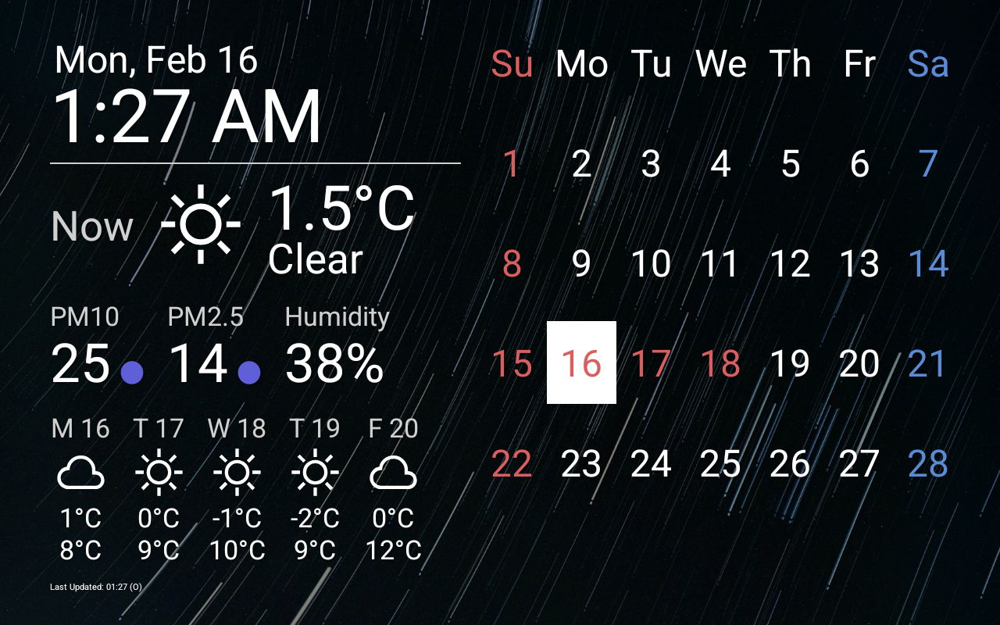
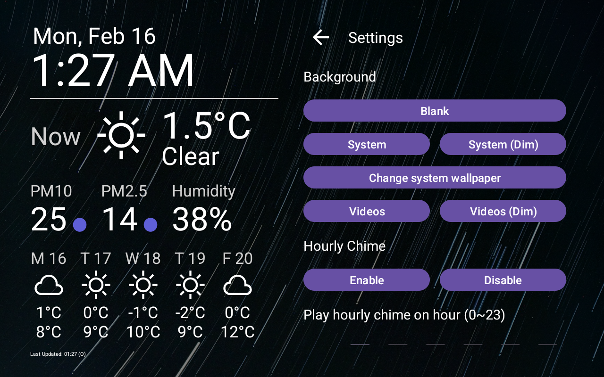

# Pantegi

Pantegi is a DIY Smart-ish Display app, made for personal use.

Just a little dumb app for repurposing an unused Android tablet into something fancy to look at.

# Screenshot



Wallpaper is [Star trails in the night sky over dark landscape photo](https://unsplash.com/photos/star-trails-in-the-night-sky-over-dark-landscape-1m8E6OTLzRk) by [Nguyen Vanh](https://unsplash.com/@galaxon_vanh).

# WARNING: Some Coding Required

You are REQUIRED to do some coding!

There will be no prebuilt APKs provided, and the source code cannot be built as it is because some components are missing.

This is due to my belief that this kind of application requires personalization beyond something that can be simply put into some "Settings", and I don't want to devote so much effort for this dingus.

Android Studio or an equivalent development environment is required.

It won't be hard, and LLMs could help.

# How to Build

## Create your own data providers

After cloning this repository, you need to create your own version of `HolidayProvider` and `WeatherProvider`.

Refer to `DummyHolidayProvider` and `DummyWeatherProvider` as these will be a good starting point.

For weather provider, if you can spare a OpenWeatherMap API key, there is a `OWMWeatherProvider` available that you can just use instead of making one from scratch.

## Make Pantegi use your data providers

After creating your own providers, you need to make Pantegi use them by changing a line in `onCreate` function of `CalendarFragment` and `WeatherFragment`.

Look for a line marked with `// TODO: change me!` comment. For example:

```java
// TODO: change me!
wp = new OWMWeatherProvider("40.9", "-112.6", "OpenWeatherMap API Key");
```

After this is done, You will be able to build and install Pantegi to your devices.

# How to Use

While running, the weather data gets automatically updated once per hour, and the calendar data gets updated once per day on midnight.



You can tap the topmost row of calendar (weekday names) to access Settings.

In Settings, you can change the background, or configure hourly chime.

## Optional Feature: Video Backgrounds

After launching Pantegi, a new directory named `bg_videos` will be created on your device.

Path may differ between devices but it's usually `/storage/emulated/0/Android/data/kr.pe.sinu.pantegi/files/bg_videos/`.

You can put any `mp4` files in this directory to enable Video Backgrounds feature.

Notes:

1) Video backgrounds will play sequentially, and loops for entire directory indefinitely.
2) Video will be stretched, so it's best to resize/crop videos first to make it fit in your device correctly.
3) Since videos are being re-encoded anyway, consider lowering bitrate of the videos. It helps a lot with performance/power consumption.

## Optional Feature: Hourly Chime

To enable hourly chime, you need to put the `chime.mp3` file to the directory containing `bg_videos`.

It's usually `/storage/emulated/0/Android/data/kr.pe.sinu.pantegi/files/`.

If Pantegi can see this file, Hourly Chime feature can be enabled. Enabling it will make Pantegi play `chime.mp3` file on every hour.

# License

Pantegi is distributed under WTFPL.